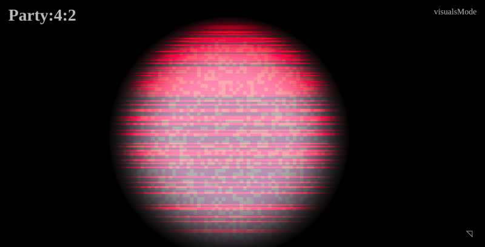

# Party:4:2

A playful audio-visual party for you and your computer.

> "It doesn't matter what you wear, 'cause it's only gonna be you and me there."
>
> ~ Shania Twain - [Party for two](https://www.youtube.com/watch?v=BzD0nd7tzNI)

Party:4:2 is the perfect occasion to get some one-on-one time with your computer.

Your computer brings some music and some lights and you bring yourself.

## What are you talking about?

This is a little art project.

More material (hopefully) coming :soon:.

## Run and build this

To run this locally install dependencies with `npm` or `yarn` and then either:

`$ yarn run start` to start the dev server (opens browser window automatically)

or

`$ yarn run build` to build into `dist`.

## Technicalities

I'm using a [small music generator](https://github.com/lislis/jukegen) that I wrote to generate melody snippets on the fly.

I wanted to use [contro](https://www.npmjs.com/package/contro) for handling user input from a gamepad with keyboard fallbacks. Sadly I didn't get it to work with my controller, so I wrote some [wrapper code myself](https://github.com/lislis/party-4-2/blob/master/src/lib/gamepad.js). But I would like to change that in the future.

The visuals are done in WebGL, feeding sound FFT data directly into the fragment shader. The webgl environment setup lives in [`lib/shader.js`](https://github.com/lislis/party-4-2/blob/master/src/lib/shader.js), the shaders themselves in [`lib/shaders`](https://github.com/lislis/party-4-2/tree/master/src/shaders). I thought performance would be decent, but I was wrong. I'd also like to revisit that.

## Thanks and credits

I want to thank the ProcGen community for writing a lot of stuff about procedual generation so people like me have a starting point for weird ideas. Especially [the article on Procedural Music Generation](http://www.procjam.com/tutorials/en/music/) that made me want to give it a shot.

I want to thank all people who work on open source software, because it's a beautiful thing that we have <3
